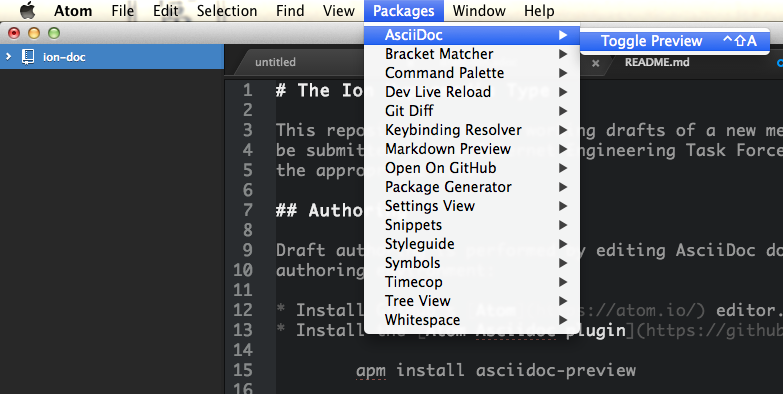

# The Ion Hypermedia Type

This repository contains working drafts of a new media type specification to
be submitted to the Internet Engineering Task Force (IETF) and RFC channels at
the appropriate time.

## Authoring

Draft authoring entails editing AsciiDoc documents.  An example
authoring environment:

* Install GitHub's [Atom](https://atom.io/) editor.
* Install the [Atom Asciidoc plugin](https://github.com/asciidoctor/atom-asciidoc-preview):

        apm install asciidoc-preview

As you edit, ensure you have the asciidoc preview pane open to see the rendered
output.  For example:

